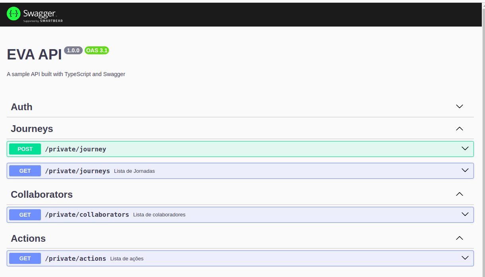

# Api Eva Test

## Prerequisites

1. Docker
2. Node

## Run API

1. Clone the repository
2. Copy the .env.example to the .env (The data is exposed because it is a test i want to make it easier)
3. run docker run --name redis -p 6379:6379 -d -t redis:alpine (To up a redis container that will be used in the bull)
4. run pnpm run dev
5. API Running!

## Docs



```
rota: /docs
```

## Run tests

```
pnpm test
```
